# Sirah Digital — CMS Architecture & Implementation Plan

**Status:** Approved 2026-08-07. **Phases 1–2 built** — the CMS exists at [`sirah-cms/`](sirah-cms/README.md): 17 collections, 8 globals, 20 blocks, typechecks and builds clean. Phase 3 (site integration) not started. Four decisions still open (§18).
**Author:** Architecture pass, 2026-08-07
**Target site:** `SirahDigital_3D_WebSite` (Next.js 14.2 App Router, JavaScript, Tailwind 3.4)

> **Approved:** ① CMS engine = **Payload 3, self-hosted, separate app**. ③ Roles at launch = **Admin only**. ⑤ Contact submissions = **stored in the CMS** (pulls India DPDP Act obligations into scope — §13.4, and a dedicated Phase 4 workstream).

---

## 1. Executive summary

**Recommendation: self-hosted Payload CMS 3 running as a separate application at `cms.sirahdigital.in`, backed by PostgreSQL and S3-compatible object storage, feeding the existing Next.js site over a cached REST API with tag-based on-demand revalidation.**

The three things driving that recommendation:

1. **The site cannot be upgraded past React 18.** `@react-three/fiber@8` and `@react-three/drei@9` are hard-pinned to React 18; their React 19 successors (v9 / v10) are a breaking migration across all the 3D work. Any CMS that installs *into* the site app (Payload 3 embedded, for example, needs Next 15 + React 19) would force that migration on a nearly-finished site. Running the CMS as its own app removes the coupling entirely — the site stays on Next 14 forever if it wants to.
2. **Building auth + versioning + scheduling + a media pipeline + an admin UI from scratch is ~10 weeks of work** that produces no customer-visible value. Payload provides all of it, MIT-licensed and self-hosted, so your data stays on your infrastructure with no per-seat SaaS bill.
3. **The real work is not the CMS — it is the site-side data layer.** 56 client components currently receive content via static `import`. Converting those to prop-fed components is the bulk of the effort and is identical no matter which CMS you pick. Choosing an engine that costs nothing to stand up lets the budget go where the work actually is.

**Estimated effort: ~8 weeks.** Roughly 25% CMS setup, 60% site integration + new content types, 15% hardening and training.

---

## 2. Current-state audit

What exists today, because the migration plan is written against it.

| Area | Current state |
|---|---|
| Framework | Next.js 14.2, App Router, **JavaScript** (`jsconfig.json`, no TypeScript) |
| Styling | Tailwind 3.4, custom `brand-*` tokens |
| Rendering | Fully static. `generateStaticParams` on `/industries/[slug]` |
| Content | 16 static modules in `src/data/*.js` |
| Components | 112 source files; **56 carry `"use client"`** (three.js, framer-motion, GSAP) |
| Images | 16 MB in `public/`; only **3 files use `next/image`** — the rest are raw ``/CSS paths |
| API | One route: `POST /api/contact` → WhatsApp gateway + optional lead webhook |
| SEO | `metadata` exports per route, `sitemap.js` and `robots.js` read from `src/data/nav.js` |
| Auth / DB | **None.** No database, no ORM, no sessions |
| Repo | `github.com/aakashkummar-workspace/SirahDigital_3D_WebSite`, branch `feat/site-redesign` |

### Content inventory (the CMS must absorb all of this)

| Module | Shape | Becomes |
|---|---|---|
| `company.js` | object | Global: **Site Settings** |
| `nav.js` | `NAV_LINKS`, `ROUTES`, `LEGACY_ANCHORS` | Globals: **Navigation**, **Redirects** collection |
| `socials.js` | array (label, href, SVG path) | Global: **Site Settings → socials** |
| `services.js` | `SERVICES` (10), `METHODOLOGY` (3) | Collection: **Services**; Global: **Methodology** |
| `serviceExperience.js` | joins `SERVICES` by slug | Fields *on* Services (not a second table) |
| `industries.js` | 12 sectors | Collection: **Industries** |
| `industryIntelligence.js` | joins `INDUSTRIES` by slug | Fields *on* Industries |
| `industryWorkflows.js` | keyed by slug, 7 steps each | Repeating field *on* Industries |
| `products.js` | `HOME_PRODUCTS` (Aura, Analytics Agents, NUSI) | Collection: **Products** |
| `projects.js` | production + development | Collection: **Case Studies** (`stage` field) |
| `clients.js` | 9 names | Collection: **Clients** |
| `team.js` | `FOUNDER` + 5 members | Collection: **Team** |
| `insightsData.js` | 3 media cards | Collection: **Insights** |
| `carouselCards.js` | 9 photo cards | Collection: **Media** + Global: **Homepage carousel** |
| `transformation.js` | 3 narrative scenes | Global: **Transformation Story** |
| `roi.js` | industry coefficients | Global: **ROI Calculator Config** |
| — *does not exist* — | — | Collection: **Blog Posts**, **Authors**, **Categories** |
| — *does not exist* — | — | Collection: **Testimonials** |

Three joins already exist in the data (`nav → services`, `industryIntelligence → industries`, `serviceExperience → services`). These become real foreign keys, which removes a whole class of "slug renamed, page broke" bugs.

---

## 3. Architecture decision

### Options considered

| | **A. Payload 3 (separate app)** ← recommended | B. Custom-built admin | C. Directus | D. SaaS (Sanity / Contentful) |
|---|---|---|---|---|
| Versioning / drafts | Native | Build it (~2 wks) | Native | Native |
| Scheduled publish | Native | Build it (~1 wk) | Via Flows | Native |
| Media + image sizes | Native (sharp) | Build it (~1.5 wks) | Native | Native |
| Auth + RBAC + 2FA | Native (+ plugin) | Build it (~2 wks) | Native | Native |
| Admin UI | Native, themeable | Build it (~4 wks) | Native | Native |
| New section types | Config + component | Full control | UI-driven | Config |
| Data ownership | **Yours (self-hosted)** | Yours | Yours | Vendor |
| Recurring cost | ~₹2–4k/mo infra | ~₹2–4k/mo infra | ~₹2–4k/mo | ₹8k–40k/mo at team size |
| Forces React 19 on site | **No** | No | No | No |
| Time to first editable content | **~2 weeks** | ~10 weeks | ~2 weeks | ~1 week |

**Why not B (custom):** you would spend ten weeks rebuilding solved problems. Revisit only if a hard requirement emerges that Payload genuinely cannot express.

**Why not C (Directus):** strong product, and its UI-driven schema is closer to "no code changes ever." But its content model is table-first, which fits tabular data better than the composed marketing pages this site is made of. Payload's block model matches the site's actual shape.

**Why not D (SaaS):** content leaves your infrastructure, cost scales with seats, and you sell self-hosted automation for a living — running someone else's CMS is off-message.

### The honest caveat on "no code changes"

The brief asks for *"a modular schema so new sections can be added without code changes."* The precise truth:

- **Adding a new section instance** to any page (another CTA band, another testimonial wall, reordered) — **zero code**, drag-and-drop in the admin.
- **Adding a field** to an existing type (a "video URL" on Products) — **one line of config**, no migration written by hand.
- **Inventing a visually new section** that has never been designed — **needs a React component.** Someone has to write the pixels; no CMS can generate a design that does not exist.

The architecture minimises case 3 by shipping a rich block library up front (§7), so the common cases are 1 and 2. Anyone claiming otherwise is selling you something.

---

## 4. System architecture

```
┌──────────────────────────────────────────────────────────────────────┐
│  Editors (non-technical)                                             │
│  → https://cms.sirahdigital.in/admin                                 │
└───────────────────────────┬──────────────────────────────────────────┘
                            │ HTTPS, HttpOnly cookie session + TOTP
                            ▼
┌──────────────────────────────────────────────────────────────────────┐
│  CMS APP  (Next 15 + Payload 3, TypeScript, Node 20)                 │
│  ├─ /admin              Admin UI                                     │
│  ├─ /api/*              REST (auto-generated per collection)         │
│  ├─ /api/graphql        GraphQL                                      │
│  ├─ hooks               afterChange → revalidate webhook to site      │
│  └─ jobs                scheduled publish/unpublish worker (cron)     │
└───────┬──────────────────────────┬───────────────────────┬───────────┘
        │                          │                       │
        ▼                          ▼                       ▼
┌───────────────┐        ┌──────────────────┐    ┌──────────────────┐
│ PostgreSQL 16 │        │ S3-compatible    │    │ Cron / Scheduler │
│ Neon or RDS   │        │ Cloudflare R2    │    │ (publish queue)  │
│ PITR backups  │        │ + CDN            │    └──────────────────┘
└───────────────┘        └──────────────────┘
        ▲                          ▲
        │                          │ next/image remotePatterns
        │  read-only, cached       │
┌───────┴──────────────────────────┴───────────────────────────────────┐
│  PUBLIC SITE  (Next 14.2 + React 18 — UNCHANGED RUNTIME)             │
│  ├─ src/lib/content/*.js   data layer: fetch + cache + tag           │
│  ├─ ISR + revalidateTag()  invalidated by CMS webhook                │
│  ├─ /api/revalidate        HMAC-verified, CMS → site                 │
│  └─ /api/preview           draftMode() for unpublished content       │
└──────────────────────────────────────────────────────────────────────┘
```

**Two apps, two repos (or one monorepo, two workspaces).** The site never talks to Postgres directly — only to the CMS's read API, over cached fetches. That keeps the site deployable to Vercel's edge with no database connection, and means a CMS outage cannot take the marketing site down (the last ISR render keeps serving).

---

## 5. Content model

### 5.1 Globals (single record each — "Settings", not "Content")

| Global | Fields |
|---|---|
| **site-settings** | `name`, `url`, `email`, `phone`, `phoneHref`, `address[]`, `addressOneLine`, `blurb`, `tagline`, `logo → media`, `defaultOgImage → media`, `socials[] { label, href, iconPath }`, `analytics { gtmId, gaId }` |
| **navigation** | `header[] { label, href, entry → any, children[] }`, `headerCta { label, href }`, `legacyAnchors[] { from, to }` |
| **footer** | `blurb`, `columns[] { heading, links[] { label, href, entry } }`, `legalLinks[]`, `copyright`, `showSocials` |
| **seo-defaults** | `titleTemplate`, `defaultTitle`, `defaultDescription`, `defaultOgImage → media`, `robotsAllow[]`, `robotsDisallow[]`, `organizationJsonLd` |
| **methodology** | `pillars[] { title, desc, accent }` (the Automate / Simplify / Scale trio) |
| **transformation-story** | `sceneMs`, `scenes[] { id, tab, tabLong, phase, accent, accentSoft, title, body, points[], status, statusTone }` |
| **roi-config** | `industries[] { id, label, automationFit, dealValue, baseConversion, recommendations[] }`, `readiness`, `investmentBase`, `disclaimer` |
| **homepage** | `sections[]` — the block array (see §7) |

Globals are versioned and draftable exactly like collections.

### 5.2 Collections

| Collection | Key fields | Notes |
|---|---|---|
| **services** | `slug`*, `title`, `desc`, `order`, `navLabel`, `visual`, `system`, `problem`, `outcome`, `ctaLabel`, `icon`, `seo`, `body` | `serviceExperience.js` merges in as fields — one record per service, not two |
| **industries** | `slug`*, `title`, `desc`, `image → media`, `alt`, `order`, `tagline`, `icon`, `accent`, `summary`, `metric { value, label }`, `outcomes[]`, `guarantee`, `stack[]`, `workflow[] { title, desc }`, `relatedServices[] → services`, `seo` | Collapses 3 modules into 1 record |
| **products** | `slug`*, `label`, `title`, `description`, `ctaLabel`, `href`, `order`, `heroImage → media`, `features[] { title, desc, icon }`, `sections[]`, `status`, `seo` | Aura Transcriber, Analytics Agents, NUSI. `sections[]` enables real product pages at `/products/[slug]` |
| **case-studies** | `slug`*, `title`, `client → clients`, `industry → industries`, `stage` (`production`\|`development`), `impact`, `phase`, `stack[]`, `desc`, `cover → media`, `body`, `metrics[] { value, label }`, `seo` | Merges `PRODUCTION_PROJECTS` + `DEVELOPMENT_PROJECTS` |
| **clients** | `name`*, `slug`, `logo → media`, `url`, `industry → industries`, `order`, `featured` | Marquee reads `featured` + `order` |
| **testimonials** | `quote`*, `authorName`, `authorRole`, `authorCompany`, `avatar → media`, `client → clients`, `rating`, `featured`, `order`, `sourceUrl` | **New** |
| **posts** (Blog) | `slug`*, `title`, `excerpt`, `cover → media`, `body` (rich text), `author → authors`, `category → categories`, `tags[]`, `readingTime` (auto), `publishedAt`, `featured`, `seo` | **New**. Routes `/blog`, `/blog/[slug]`, `/blog/category/[slug]` |
| **authors** | `name`*, `slug`, `role`, `bio`, `photo → media`, `socials[]`, `teamMember → team` | **New** |
| **categories** | `name`*, `slug`, `description`, `color` | **New** |
| **team** | `name`*, `role`, `bio`, `photo → media`, `order`, `isFounder`, `socials[]` | `FOUNDER` = the `isFounder` record |
| **insights** | `title`*, `cover → media`, `coverAlt`, `category`, `description`, `duration`, `date`, `youtubeUrl`, `theme`, `order` | Video/media carousel |
| **carousel-cards** | `image → media`*, `alt`, `title`, `desc`, `href`, `ctaLabel`, `order` | Homepage 3D carousel. Keep count odd |
| **pages** | `slug`*, `title`, `sections[]`, `seo`, `status`, `publishAt` | Generic pages — `/privacy`, `/terms`, and anything new |
| **media** | `alt`*, `caption`, `filename`, `mimeType`, `width`, `height`, `filesize`, `focalPoint`, `blurDataURL`, `sizes{}`, `folder` | See §9 |
| **redirects** | `from`*, `to`, `permanent` | Replaces the hardcoded list in `next.config.js` |
| **leads** | `firstName`, `lastName`, `email`, `phone`, `company`, `message`, `sourcePath`, `status` (`new`\|`contacted`\|`qualified`\|`won`\|`lost`), `owner → users`, `notes[]`, `consentGivenAt`, `consentText`, `ipHash`, `purgeAt`, `createdAt` | **Approved.** Persisted alongside the WhatsApp push. Carries PII → see §13.4 |
| **users** | `email`*, `password`, `name`, `role`, `totpSecret`, `mustChangePassword` | §12 |

`*` = required. `→` = relationship (real FK).

---

## 6. ER diagram

This is the **canonical domain model**. It is what needs approval; it holds regardless of engine. Payload's Postgres adapter generates this shape plus its own `_versions` / `_rels` tables.

```mermaid
erDiagram
    USERS ||--o{ SESSIONS : opens
    USERS ||--o{ ENTRY_VERSIONS : authors
    USERS ||--o{ AUDIT_LOG : performs
    USERS ||--o{ MEDIA : uploads
    USERS ||--o{ LEADS : owns

    CONTENT_TYPES ||--o{ ENTRIES : defines
    ENTRIES ||--o{ ENTRY_VERSIONS : "has history"
    ENTRIES ||--o| ENTRY_VERSIONS : "current draft"
    ENTRIES ||--o| ENTRY_VERSIONS : "live published"
    ENTRIES ||--o{ ENTRY_RELATIONS : "links from"
    ENTRIES ||--o{ ENTRY_RELATIONS : "links to"
    ENTRIES ||--o| SEO_META : carries
    ENTRIES ||--o{ ENTRY_MEDIA : references
    ENTRIES ||--o{ SCHEDULED_JOBS : queues
    ENTRIES ||--o{ NAVIGATION_ITEMS : "linked by"

    MEDIA ||--o{ MEDIA_RENDITIONS : generates
    MEDIA ||--o{ ENTRY_MEDIA : "used in"
    MEDIA_FOLDERS ||--o{ MEDIA : contains
    MEDIA_FOLDERS ||--o{ MEDIA_FOLDERS : nests

    NAVIGATION_ITEMS ||--o{ NAVIGATION_ITEMS : nests

    USERS {
        uuid   id PK
        text   email UK
        text   password_hash
        text   name
        text   role "admin editor viewer"
        text   totp_secret "encrypted"
        bool   totp_enabled
        bool   must_change_password
        int    failed_attempts
        ts     locked_until
        ts     last_login_at
        ts     created_at
    }

    SESSIONS {
        uuid   id PK
        uuid   user_id FK
        text   token_hash
        inet   ip
        text   user_agent
        ts     expires_at
        ts     revoked_at
    }

    CONTENT_TYPES {
        uuid   id PK
        text   key UK "services industries posts"
        text   name
        text   kind "collection global"
        jsonb  field_schema "drives admin form"
        jsonb  ui_schema "grouping order widgets"
        bool   is_system
        int    schema_version
    }

    ENTRIES {
        uuid   id PK
        uuid   content_type_id FK
        text   slug
        text   locale "en default"
        text   status "draft published scheduled archived"
        uuid   current_version_id FK
        uuid   published_version_id FK
        ts     publish_at
        ts     unpublish_at
        int    order_index
        uuid   created_by FK
        uuid   updated_by FK
        ts     created_at
        ts     updated_at
    }

    ENTRY_VERSIONS {
        uuid   id PK
        uuid   entry_id FK
        int    version_no
        jsonb  data "all typed fields"
        jsonb  blocks "section array"
        text   note "editor changelog"
        text   status_at_save
        uuid   author_id FK
        ts     created_at
    }

    ENTRY_RELATIONS {
        uuid   id PK
        uuid   from_entry_id FK
        uuid   to_entry_id FK
        text   relation_key "relatedServices author client"
        int    order_index
    }

    SEO_META {
        uuid   entry_id PK
        text   title
        text   description
        text   canonical
        uuid   og_image_id FK
        bool   no_index
        jsonb  json_ld
    }

    MEDIA {
        uuid   id PK
        text   filename
        text   storage_key UK
        text   mime_type
        bigint bytes
        int    width
        int    height
        text   checksum_sha256 UK
        text   alt
        text   caption
        float  focal_x
        float  focal_y
        text   blur_data_url
        uuid   folder_id FK
        uuid   uploaded_by FK
        ts     created_at
    }

    MEDIA_RENDITIONS {
        uuid   id PK
        uuid   media_id FK
        text   preset "thumb card hero og"
        text   format "avif webp jpeg"
        int    width
        int    height
        bigint bytes
        text   storage_key
    }

    MEDIA_FOLDERS {
        uuid   id PK
        uuid   parent_id FK
        text   name
        text   path
    }

    ENTRY_MEDIA {
        uuid   entry_id FK
        uuid   media_id FK
        text   field_path "prevents orphan delete"
    }

    NAVIGATION_ITEMS {
        uuid   id PK
        text   menu_key "header footer_col_1"
        uuid   parent_id FK
        text   label
        text   href
        uuid   entry_id FK
        int    order_index
        text   target
        bool   is_cta
    }

    SCHEDULED_JOBS {
        uuid   id PK
        text   kind "publish unpublish revalidate"
        uuid   entry_id FK
        ts     run_at
        text   status "pending done failed"
        int    attempts
        text   last_error
        ts     locked_at "worker lease"
    }

    REDIRECTS {
        uuid   id PK
        text   source UK
        text   destination
        bool   permanent
        bigint hits
    }

    AUDIT_LOG {
        uuid   id PK
        uuid   actor_id FK
        text   action "create update publish delete login"
        text   entity_type
        uuid   entity_id
        jsonb  diff
        inet   ip
        ts     created_at
    }

    API_KEYS {
        uuid   id PK
        text   name
        text   key_hash UK
        text   scopes "read_published revalidate"
        ts     last_used_at
        ts     expires_at
        ts     revoked_at
    }

    LEADS {
        uuid   id PK
        text   first_name
        text   last_name
        text   email
        text   phone
        text   company
        text   message
        text   source_path
        text   ip_hash "salted hash never raw"
        text   status "new contacted qualified won lost"
        uuid   owner_id FK
        jsonb  notes
        ts     consent_given_at
        text   consent_text "exact wording shown"
        ts     purge_at "createdAt plus 24 months"
        ts     created_at
    }
```



### The three load-bearing ideas in this model

1. **`content_types.field_schema` is the modular-schema mechanism.** The admin form is *rendered from* this JSON, not hand-coded. Add a field to the schema, the form grows a field. This is what makes new content types cheap.
2. **`entries` + `entry_versions` separates identity from content.** An entry's URL, ordering and relationships are stable columns; its editable body is an immutable version row. `published_version_id` and `current_version_id` pointing at different rows *is* the draft/publish workflow — the live site reads one, the editor edits the other.
3. **`entry_media` prevents the classic CMS failure** of someone deleting an image that six pages still use. Deletion checks this table and refuses with a list of dependents.

---

## 7. The modular section system (page builder)

The mechanism behind "new sections without code changes."

```
pages.sections = [
  { blockType: 'hero',          heading, sub, ctaLabel, ctaHref, media },
  { blockType: 'productGrid',   heading, products: [→products] },
  { blockType: 'testimonialWall', heading, testimonials: [→testimonials], layout },
  { blockType: 'ctaBand',       heading, body, ctaLabel, ctaHref },
]
```

On the site, one registry file and one renderer:

```js
// src/components/blocks/registry.js
export const BLOCKS = {
  hero: Hero,
  productGrid: HomeProductsBlock,
  serviceChapters: ServiceChapters,
  industryOrbit: IndustryOrbit,
  clientMarquee: TrustedClientsMarquee,
  testimonialWall: TestimonialWall,
  insightsCarousel: InsightsSuccessStories,
  transformationStory: VisualTransformationStory,
  roiCalculator: AIAutomationROICalculator,
  perspectiveCarousel: PerspectiveCarousel,
  methodologyJourney: MethodologyJourney,
  ctaBand: CTABand,
  richText: RichText,
  statBand: StatBand,
  logoWall: LogoWall,
  faq: FAQ,
  timeline: WorkflowTimeline,
  spacer: Spacer,
};

// <SectionRenderer sections={page.sections} /> maps blockType → component.
// Unknown blockType renders nothing in prod, a visible warning in dev.
```

**Every existing homepage component becomes a block.** Once that is done, the team can rebuild the homepage, build a landing page for a campaign, or add a testimonial wall to `/services` — all from the admin, with no deploy.

**Cost of a genuinely new block type:** one Payload block config (~15 lines) + one React component + one registry line. Roughly half a day for a simple block. That is the floor, and it is the same floor in every CMS on earth.

---

## 8. Draft / publish / versioning / scheduling

### Version history
- Every save writes a new `entry_versions` row. Nothing is ever overwritten.
- Retention: keep **50 versions per entry** (configurable), plus every version that was ever published, forever.
- Admin shows a version list with author, timestamp and optional note; diff view field-by-field; **one-click restore** (which creates a *new* version rather than rewriting history).

### Draft / publish workflow
```
   ┌────────┐  save   ┌────────┐  publish  ┌───────────┐
   │  new   │────────▶│ draft  │──────────▶│ published │
   └────────┘         └────────┘           └───────────┘
                          ▲   │ schedule        │ unpublish
                          │   ▼                 ▼
                          │ ┌───────────┐  ┌──────────┐
                          └─│ scheduled │  │ archived │
                            └───────────┘  └──────────┘
```
- An entry can be **published *and* have an unpublished draft** simultaneously — the site keeps serving the live version while an editor works. This is `published_version_id ≠ current_version_id`.
- **Preview:** admin "Preview" button opens the site with `?preview=<signed-token>`; the site's `/api/preview` verifies it, calls `draftMode().enable()`, and the data layer then fetches `?draft=true`. Editors see unpublished work on the real design, not in a form.

### Scheduled publishing

> **Revised during implementation.** Payload 3.87 ships `versions.drafts.schedulePublish` natively, driven by its own job queue. The bespoke `scheduled_jobs` table and worker specced here were therefore **not built for publishing** — using the framework's tested implementation beats maintaining our own. The custom worker survives only for lead purging, which Payload has no opinion about.

- Setting a publish date in the future queues a Payload job and leaves the document unpublished.
- The queue runs **every minute** via `jobs.autoRun` in `payload.config.ts`, or from external cron against `POST /api/payload-jobs/run` with a `CRON_SECRET` bearer token.
- `autoRun` is correct for a **single instance**. On a multi-instance deploy it must be removed in favour of external cron, or two instances race for the same job.
- Unpublish-at-a-date works the same way in reverse.

---

## 9. Media pipeline & image optimization

Today: 16 MB of unoptimized files in `public/`, and only 3 components use `next/image`. This is the single biggest available performance win.

**On upload**, the CMS (sharp) produces:

| Preset | Width | Used by |
|---|---|---|
| `thumb` | 200 | Admin grid, avatars |
| `card` | 640 | Industry tiles, blog cards, carousel |
| `hero` | 1280 | Page heroes, blog covers |
| `wide` | 1920 | Full-bleed sections |
| `og` | 1200×630 | Social sharing (fixed crop, focal-point aware) |

Each preset in **AVIF + WebP + JPEG** fallback. Originals are retained. Plus, computed once at upload and stored on the record:
- **`blurDataURL`** — a ~30-byte base64 LQIP so `next/image` gets a real `placeholder="blur"` on remote images.
- **`focalPoint`** — so a 5:7 carousel crop and a 1200×630 OG crop of the same photo both keep the subject in frame. This matters: `carouselCards.js` currently documents "cut to exactly 5:7 before dropping them in" as a manual step. Focal points delete that chore.
- **`checksum_sha256`** — deduplicates re-uploads of the same file.

**Delivery:** objects live in Cloudflare R2 behind the CDN. The site adds one `remotePatterns` entry to `next.config.js` and uses `next/image` everywhere. Long-lived immutable cache headers are safe because storage keys are content-hashed.

**Migration:** existing `public/` assets are imported into the media library as a one-off script, keeping their paths working via a legacy alias until components are converted.

---

## 10. Site integration & rendering strategy

The part that is genuinely new work.

### The data layer

Today a client component does `import { CLIENTS } from '@/data/clients'`. That cannot become an async DB call — client components cannot fetch at render. The pattern:

```js
// src/lib/content/clients.js  (server-only)
import { cache } from 'react';

export const getClients = cache(async () => {
  const res = await fetch(`${CMS_URL}/api/clients?where[featured][equals]=true&sort=order&depth=1`, {
    headers: { Authorization: `Bearer ${CMS_READ_KEY}` },
    next: { tags: ['clients'], revalidate: 3600 },
  });
  if (!res.ok) throw new ContentError('clients', res.status);
  return res.json().then((r) => r.docs);
});
```

Then the **server** page fetches and passes down:

```js
// app/(site)/page.js  — server component
const clients = await getClients();
return <TrustedClientsMarquee clients={clients} />;   // client component, now prop-fed
```

**This prop-threading across 56 client components is the bulk of Phase 3.** It is mechanical but it is not free, and it is unavoidable with any CMS.

### Caching & invalidation

- Pages stay **static (ISR)**. Build-time render + `revalidate: 3600` as a safety net.
- The CMS `afterChange` hook POSTs to the site's `/api/revalidate` with an HMAC signature; the site calls `revalidateTag('clients')`. **Edits go live in seconds, with no rebuild and no deploy.**
- `generateStaticParams` for `/industries/[slug]`, `/blog/[slug]`, `/products/[slug]` reads from the CMS at build; new entries published later are served by `dynamicParams: true` + ISR, so a new blog post is live without a build.
- **Resilience:** if the CMS is down at build time, the build fails loudly (correct). If it is down at request time, the cached static page still serves. The marketing site does not go down because the CMS did.

### SEO
- `generateMetadata` reads `seo_meta` per entry, falling back to the `seo-defaults` global.
- `sitemap.js` and `robots.js` become dynamic — driven by published entries, not the hardcoded `ROUTES` array. A new blog post appears in the sitemap automatically.
- `redirects` move from `next.config.js` into the DB, served by `middleware.js` (a `next.config` redirect requires a deploy; a DB-backed one does not).
- JSON-LD: `Organization` from Site Settings, `Article` per post, `BreadcrumbList` per nested route.

---

## 11. API endpoints

### CMS — auth
| Method | Path | Purpose |
|---|---|---|
| POST | `/api/users/login` | Email + password → HttpOnly cookie. Step-up to TOTP |
| POST | `/api/users/login/2fa` | Verify TOTP, issue full session |
| POST | `/api/users/logout` | Revoke session |
| POST | `/api/users/refresh-token` | Rotate short-lived token |
| GET | `/api/users/me` | Current user + permissions |
| POST | `/api/users/forgot-password` | Email reset link (single-use, 30 min) |
| POST | `/api/users/reset-password` | Consume token, set password |
| POST | `/api/users/2fa/enrol` · `/verify` | TOTP secret + QR, confirm enrolment |

### CMS — content (auto-generated per collection; `{c}` ∈ services, industries, products, case-studies, clients, testimonials, posts, authors, categories, team, insights, carousel-cards, pages, media, redirects, leads)
| Method | Path | Purpose |
|---|---|---|
| GET | `/api/{c}` | List. `?where=…&sort=&limit=&page=&depth=&draft=true` |
| GET | `/api/{c}/{id}` | Read one |
| POST | `/api/{c}` | Create |
| PATCH | `/api/{c}/{id}` | Update (writes a new version) |
| DELETE | `/api/{c}/{id}` | Delete (blocked if `entry_media`/relations depend on it) |
| GET | `/api/{c}/versions` | Version list |
| GET | `/api/{c}/versions/{versionId}` | Read a version |
| POST | `/api/{c}/versions/{versionId}` | **Restore** that version |
| GET · POST | `/api/globals/{slug}` | Read / write a global |
| GET · POST | `/api/globals/{slug}/versions` | Global version history |
| POST | `/api/graphql` | GraphQL for complex joins |

### CMS — custom
| Method | Path | Purpose |
|---|---|---|
| GET | `/api/site/bundle?locale=en` | **One aggregated response** of every global + small collection. Turns ~12 build-time round-trips into 1 |
| POST | `/api/media` | Multipart upload → renditions + blurDataURL |
| POST | `/api/schedule/run` | Cron-triggered publish worker. Bearer `CRON_SECRET` |
| GET | `/api/health` | DB + storage liveness |
| GET | `/api/sitemap-entries` | Published slugs + `updated_at` for the site's sitemap |
| DELETE | `/api/leads/{id}/erase` | **DPDP erasure.** Admin-only, hard delete, writes a tombstone to `audit_log` |
| GET | `/api/leads/export` | CSV export. Admin-only, rate-limited, audit-logged |
| POST | `/api/jobs/purge-leads` | Daily cron. Hard-deletes rows past `purge_at`. Bearer `CRON_SECRET` |

### Site
| Method | Path | Purpose |
|---|---|---|
| POST | `/api/revalidate` | **CMS → site.** HMAC-SHA256 signed, replay-protected. Body `{ tags: [], paths: [] }` |
| GET | `/api/preview` | Signed token → `draftMode().enable()` → redirect to the previewed path |
| GET | `/api/exit-preview` | Disable draft mode |
| POST | `/api/contact` | **Existing.** Extended to also write a `leads` row |

**Conventions:** JSON only; `4xx` carries `{ error, code, field? }`; list responses carry `{ docs, totalDocs, page, totalPages, hasNextPage }`; every response carries `X-Request-Id` for log correlation.

---

## 12. Admin account, login & roles

### Access

| | |
|---|---|
| **Admin URL** | `https://cms.sirahdigital.in/admin` |
| **Bootstrap admin** | `admin@sirahdigital.in` |
| **Initial password** | Generated at deploy, injected via `PAYLOAD_SEED_ADMIN_PASSWORD`, **never committed** |
| **First login** | Forced password change + mandatory TOTP enrolment before the dashboard is reachable |

**Generate the bootstrap password at deploy time:**

```bash
node -e "const c=require('crypto');const A='ABCDEFGHJKLMNPQRSTUVWXYZabcdefghijkmnopqrstuvwxyz23456789!@#%^*_-+=';console.log([...Array(28)].map(()=>A[c.randomInt(A.length)]).join(''))"
```

A sample of that generator's output — **for shape reference only, regenerate your own**:

```
AdZSVXcnmjk6rZaeo9w_2^byV8zR
```

Put it in the CMS app's environment (Vercel/Railway secret, or `.env` with `chmod 600`), never in git, and hand it to the first admin over a channel that is not email — then it is discarded, because first login forces a change.

**Do not ship a fixed, documented admin password.** Any credential written into a plan document is a credential that ends up in a repo, a screenshot and a Slack thread. The seed-and-rotate flow above gives the same convenience with none of that exposure.

### Password policy
Argon2id hashing (memory 64 MB, time 3, parallelism 4). Minimum 12 characters, checked against the k-anonymity range API of Have I Been Pwned on set/change. No forced periodic rotation (NIST SP 800-63B) — rotate on suspicion instead.

### Roles

| Role | Can |
|---|---|
| **Admin** | Everything: users, roles, redirects, settings, delete, publish |
| **Editor** | Create/edit/publish all content; upload media. **No** user management, no destructive settings |
| **Contributor** | Create and edit drafts; **cannot publish**. For freelance copywriters |
| **Viewer** | Read-only, incl. preview. For stakeholder review |

The brief says *"design it for Admin"* — so **launch with Admin only**, and seed Editor/Contributor/Viewer in the schema from day one. Adding a teammate later is then a dropdown, not a migration. Access control lives in per-collection functions, not in UI conditionals.

---

## 13. Security considerations

### Authentication & session
- HttpOnly · Secure · `SameSite=Lax` cookies. Access token 15 min, refresh 7 days, **rotating** with reuse detection (a replayed refresh token revokes the whole family).
- Rate limits: **5 login attempts / 15 min** per IP+email, then exponential lockout. Global limit 100 req/min per IP on `/api/*`.
- Mandatory TOTP 2FA for every account with publish rights. Recovery codes issued once, hashed at rest.
- TOTP secrets encrypted at rest with a KMS-held key, not stored plaintext.
- **Defense in depth:** put Cloudflare Access (or an IP allowlist) in front of `/admin`. Even a total auth bypass then needs a second, independent credential.

### Application
- **CSRF:** Payload's `csrf` origin whitelist set to the CMS and site domains only. State-changing requests require the `Origin` header to match.
- **XSS:** rich text is stored as a **Lexical AST, not HTML**, and serialized to React elements on the site — there is no `dangerouslySetInnerHTML` path to attack. Any raw-HTML block (if ever added) passes through DOMPurify server-side.
- **SQL injection:** parameterized queries via Drizzle/Postgres adapter. No string-built SQL anywhere.
- **Uploads** — the most commonly botched surface:
  - Validate by **magic-byte sniffing**, not file extension or client `Content-Type`.
  - Allowlist: JPEG, PNG, WebP, AVIF, GIF, PDF, MP4. **SVG rejected by default** (it is executable XML); if a client logo demands SVG, sanitize with `svg-hush` and serve from a separate origin.
  - 20 MB cap; re-encode every raster through sharp, which strips EXIF (including GPS coordinates from staff phone photos) and neutralizes polyglot files.
  - Randomized content-hashed storage keys — never the user-supplied filename.
  - Serve from the R2 domain with `X-Content-Type-Options: nosniff` and `Content-Disposition: inline` only for known-safe types.
- **IDOR / access control:** every collection declares `read`/`create`/`update`/`delete` functions. Default deny. Unauthenticated reads are limited to `status = published`.
- **Mass assignment:** field-level access blocks `role`, `totpSecret` and `mustChangePassword` from ever being set through the public update path.
- **Webhook integrity:** `/api/revalidate` verifies an HMAC-SHA256 signature over the raw body with a timestamp, rejects anything older than 5 minutes, and compares with `crypto.timingSafeEqual`.

### Headers & transport
HSTS (`max-age=63072000; includeSubDomains; preload`), a CSP with no `unsafe-eval` on the public site, `X-Frame-Options: DENY` on `/admin` (frame-ancestors limited to the site origin only for live preview), TLS 1.2+, HTTP→HTTPS redirect.

### 13.4 Data protection — now a build item

Storing leads was approved, so **India's DPDP Act 2023 obligations move from advisory to deliverable.** You are Chennai-based, you will hold identifiable contact details at rest, and you are therefore a Data Fiduciary. Five concrete requirements, each with an owner in Phase 4:

| Requirement | Implementation |
|---|---|
| **Notice & consent** | An explicit, unticked consent checkbox on the contact form — not a pre-tick, not implied by submission. The **exact wording shown** is copied into `leads.consent_text` at submission time, so you can prove later what someone actually agreed to when the copy has since changed |
| **Purpose limitation** | Leads are used for responding to the enquiry only. Any later marketing use needs fresh consent |
| **Retention** | `purge_at = created_at + 24 months`, set at insert. A daily job hard-deletes expired rows and writes a tombstone to `audit_log`. Retention is enforced by code, not by policy documents nobody reads |
| **Erasure & access** | `DELETE /api/leads/{id}/erase` (admin-only) hard-deletes and logs. A documented inbox route for subject requests, answerable within 30 days |
| **Breach notification** | Documented runbook: notify the Data Protection Board and affected individuals. Sentry alerting plus `audit_log` make the blast radius answerable rather than guessed at |

Also: `leads.ip_hash` stores a **salted** SHA-256, never the raw IP. Lead exports are admin-only and audit-logged. Leads are excluded from database branches used for staging — staging never sees real customer data.

- Postgres encrypted at rest; TLS in transit; secrets in the platform secret store, never in the repo.
- **Backups:** nightly `pg_dump` to R2 with 30-day retention, plus provider PITR (Neon gives 7 days). R2 object versioning on the media bucket. **Test a restore quarterly** — an untested backup is a rumour.
- `audit_log` records every create/update/publish/delete/login with actor, IP and a field-level diff.

### Operations
- Dependabot/Renovate + `npm audit` in CI; block deploys on High/Critical.
- Structured JSON logs with request IDs; Sentry on both apps; uptime checks on `/api/health` and the site root.
- Staging environment with its own DB and bucket. **Never point staging at production data.**
- Quarterly access review; offboarding revokes sessions immediately, not just the password.

---

## 14. Infrastructure & cost

| Component | Choice | Indicative cost |
|---|---|---|
| Public site | Vercel (or current host) | Free–$20/mo |
| CMS app | Railway / Render / your VPS | $5–20/mo |
| Database | Neon Postgres (PITR, branching) | Free–$19/mo |
| Object storage | Cloudflare R2 (zero egress fees) | ~$0.15/mo at 16 MB → <$5/mo realistically |
| Email (password reset) | Resend / SES | Free tier |
| Monitoring | Sentry + UptimeRobot | Free tier |
| **Total** | | **≈ $10–60/mo (₹900–5,000)** |

**Environments:** `local` → `staging` (`cms-staging.sirahdigital.in`) → `production`. Separate DB, bucket and secrets per environment. Schema changes ship as migrations, reviewed in PR, applied on deploy.

---

## 15. Migrating the existing content

A one-off, idempotent seed script (`scripts/seed-from-data.mjs`) that imports each `src/data/*.js` module and POSTs to the CMS Local API. Run it repeatedly against staging until the output matches the live site exactly.

Order matters, because of the foreign keys:

```
1. media          (import public/** — carousel, industries, insights, team)
2. globals        (site-settings, seo-defaults, navigation, footer,
                   methodology, transformation-story, roi-config)
3. clients        → 4. industries (needs media)  → 5. services
6. products       → 7. case-studies (needs clients + industries)
8. team           → 9. authors (linked to team)  → 10. categories
11. insights      → 12. carousel-cards (needs media)
13. pages         (privacy, terms → richText blocks; homepage → section array)
14. redirects     (lift from next.config.js + LEGACY_ANCHORS)
```

**Verification gate:** a diff harness renders every route against static data and against CMS data, and asserts the HTML matches. The `src/data/*.js` modules are not deleted until that harness is green — they stay as a rollback path for one release cycle, then go.

---

## 16. Phased roadmap

| Phase | Scope | Deliverable / acceptance | Est. |
|---|---|---|---|
| **0. Approval & provisioning** | Sign off this document. Provision Neon, R2, domains, secrets, staging | Infra reachable; `/api/health` green on staging | **3 days** |
| ~~**1. CMS foundation**~~ ✅ | Payload 3 app scaffold, Postgres adapter, S3/R2 storage, auth + seeded admin, upload hardening | **Built.** Typechecks and builds clean. TOTP columns exist; login step-up deferred to Phase 6 | done |
| ~~**2. Content model**~~ ✅ | All collections + globals from §5, access control, block library, seed script | **Built.** 17 collections, 8 globals, 20 blocks, idempotent seed reading the site's own `src/data` modules | done |
| **3. Site data layer** ⚠️ | `src/lib/content/*`, prop-thread the 56 client components, ISR + tag revalidation, dynamic sitemap/robots/redirects, `next/image` conversion | Diff harness green on every route; an admin edit is live in <30s with no deploy; Lighthouse ≥ previous | **2 weeks** |
| **4. New content types** | Blog (`/blog`, `/blog/[slug]`, category + author pages, RSS), Testimonials + `TestimonialWall` block, Product pages `/products/[slug]` — replacing the `href: '/contact'` TODOs | A non-technical editor publishes a blog post end-to-end, unaided | **1.5 weeks** |
| **4b. Leads + DPDP** | Extend `POST /api/contact` to write a `leads` row; consent checkbox + captured wording; lead inbox with status/owner/notes; retention job, erasure endpoint, audit-logged CSV export; privacy-policy copy update | A submission appears in the admin with its consent text; a row past `purge_at` is gone the next morning and tombstoned in `audit_log` | **+3 days** |
| **5. Editorial features** | Block registry + page builder for all sections, live preview, scheduled-publish worker, version diff + restore UI, roles | Editor schedules a post for next Tuesday 09:00; it publishes itself and the page revalidates | **1 week** |
| **6. Hardening & handover** | Pen-test pass on §13, rate limits, CSP, restore drill, Sentry, editor handbook + a recorded walkthrough | Restore drill passes; team trained; production cutover | **1 week** |

**Total ≈ 8.5 weeks** (8 weeks + Phase 4b).

⚠️ **Phase 3 sequencing note:** an agent is currently working on the header. `Navbar.jsx` and `nav.js` must be the **last** files touched in Phase 3, after that work lands — otherwise the two efforts collide in the same files.

### Suggested delivery order if you want value sooner
Phases 0–2 alone (≈2.5 weeks) already give the team a working admin with all content in it. Phase 3 is what makes edits appear on the site. If budget is staged, that is the natural break — but note that content is not *live-editable* until Phase 3 completes, so do not stop there indefinitely.

---

## 17. Risks

| Risk | Likelihood | Impact | Mitigation |
|---|---|---|---|
| Prop-threading 56 client components takes longer than estimated | **High** | Medium | Convert route by route with the diff harness gating each; the static modules stay as a rollback path |
| Someone "helpfully" upgrades the site to Next 15 | Medium | **High** | Pin `next@14.x` exactly; add a CI check asserting React 18; document the r3f constraint in `CLAUDE.md` |
| Header work collides with Phase 3 | Medium | Low | Sequence `Navbar`/`nav.js` last (above) |
| CMS unavailable during a production build | Low | Medium | Builds fail loudly; last good static output keeps serving; `/api/site/bundle` snapshot cached in CI as a fallback |
| Editors overwrite each other | Medium | Low | Row-level document locking on edit + "another editor is in here" banner |
| Image library grows unbounded | Medium | Low | Orphan report via `entry_media`; 20 MB cap; R2 lifecycle rules |
| TypeScript in the CMS app vs JavaScript site | Low | Low | The boundary is a REST API. The site team never opens the CMS's TS config |

---

## 18. Decisions

### Settled — 2026-08-07

| # | Decision | Outcome | Consequence |
|---|---|---|---|
| 1 | **CMS engine** | **Payload 3, self-hosted, separate app** | §4 architecture stands as written. Site runtime untouched |
| 3 | **Roles at launch** | **Admin only**, as briefed | Editor/Contributor/Viewer stay seeded in the schema and in the access-control functions but are not issued. Adding one later is a dropdown, not a migration |
| 5 | **Leads persistence** | **Store in the CMS** | Adds Phase 4b (+3 days) and §13.4. Consent checkbox, 24-month enforced retention, erasure endpoint and audit-logged export are now deliverables, not options |

### Still open — needed before Phase 0

2. **Hosting** — Vercel (site) + Railway (CMS) + Neon (DB) + R2 (media), or consolidate onto an existing VPS? *Affects Phase 0 provisioning only; everything above is portable either way.*
4. **Blog scope** — full Phase 4 (posts + categories + authors + RSS), or posts-only MVP first? *Posts-only saves ~4 days and is a clean subset; nothing has to be undone to add the rest later.*
6. **Multi-language** — the model carries a `locale` column from day one, so this is reversible. Confirm **English-only** for now so no translation UI gets built prematurely.
7. **Domain** — confirm `cms.sirahdigital.in`, and confirm you can add the DNS record.

None of these four block writing the Payload config or the content model, so Phase 1–2 work can begin once hosting (#2) is chosen.

---

*Nothing in this document has been implemented. On approval of the remaining four, Phase 0 begins with infrastructure provisioning and a schema migration PR — no files under `SirahDigital_3D_WebSite/src` are modified until Phase 3, and `Navbar.jsx` / `nav.js` are last in that phase.*
